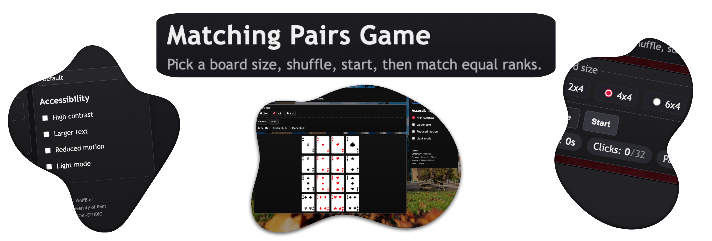

# Matching Pairs Game - WebApp
A simple pairs matching game made with vanilla web technologies (HTML, CSS & JavaScript).

 

---

## Overview

A simple pairs matching game made with vanilla web technologies (HTML, CSS & JavaScript).

For my Internet Technologies module, I was tasked to create an interactive web application in "Matching Pairs Game". I achieved 94.8% for this project, which accounts for a 60% weighting toward my overall module grade.

In essence, the aim of the game is to shuffle some cards around, and as you try your best to memorise them, they flip over. You are then tasked to match the corresponding pairs whilst adhering to the click rate limit.

This WebApp includes some QOL features such as Accessibility settings (High contrast mode, Reduced Motion etc.), Flip animations, Board size selection, Themes, and more.

---

## Feedback (Grade Breakdown)

| Grade Criteria & Mark Given | Comment |
|--------|---------|
| `General Correctness (4/5)` | "The validator finds lots of 'Trailing Slash's in your HTML code."  |
| `Design & Coding quality (4/5)` | "A bold design but...It is not what the client specified. Providing extras that were not requested is generally frowned upon. Always stick to the spec. (Works very well on a phone as well)" |
| `Task 1 (4/5)`| "You lose a mark here because the Shuffle, start and counters are not requested to be visible at this stage in the game. ( I love the timer. You have put a lot of work into this, well done)" |
| `Task 2 (6/6)` | "Cards all neatly displayed and ready to play. ( This is the point where the Shuffle and start buttons are required to become visible - elements of the game only appear when they are required.)" |
| `Task 3 (5/5)`| "Shuffle works fine" |
| `Task 4 (6/6)`| "Start button readies the board for play. (The quit button is an excellent idea)" | 
| `Task 5 (5/5)`| "All works well. Very nice piece of animation on the card flip." | 
| `Task 6 (10/10)`| "End game all functions correctly, providing a message and offering a chance to play again." | 

---

## Files  

| Script | Purpose |
|--------|---------|
| `index.html` | Index |
| `style.css` | Stylesheet |
| `script.js`| Handles the interactivity of the WebApp |
| `/images` | Folder containing 25 images of different card suits and numbers  |
| `/themes`| In game themes — contains a range of images, relevant to the university / assignment to add life to the project | 

---

